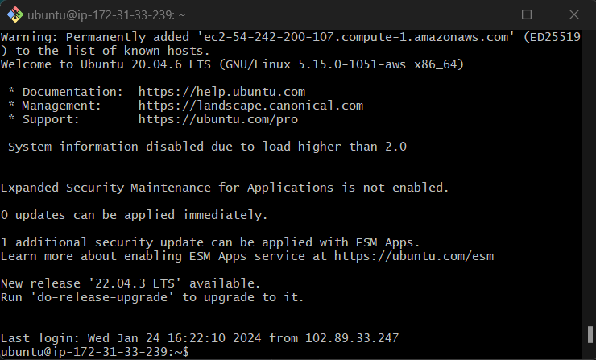
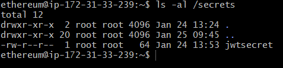
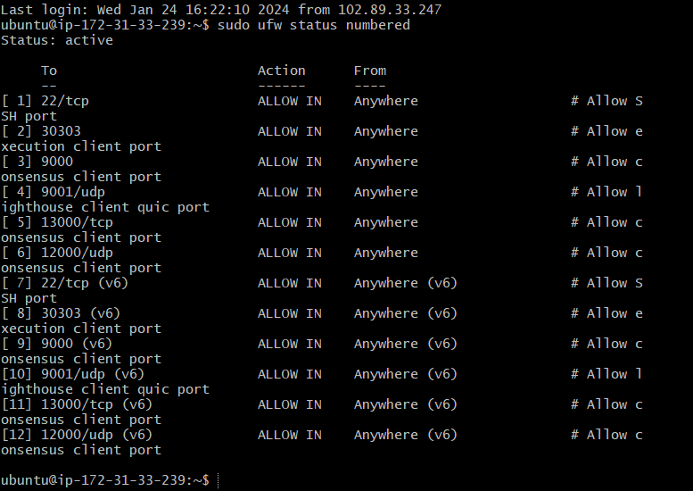
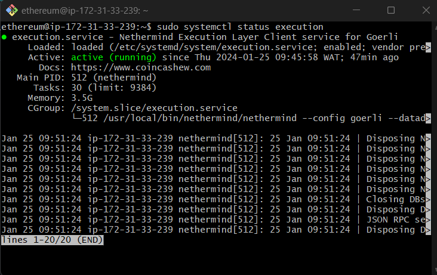
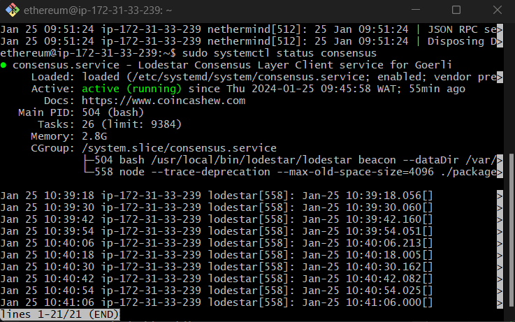
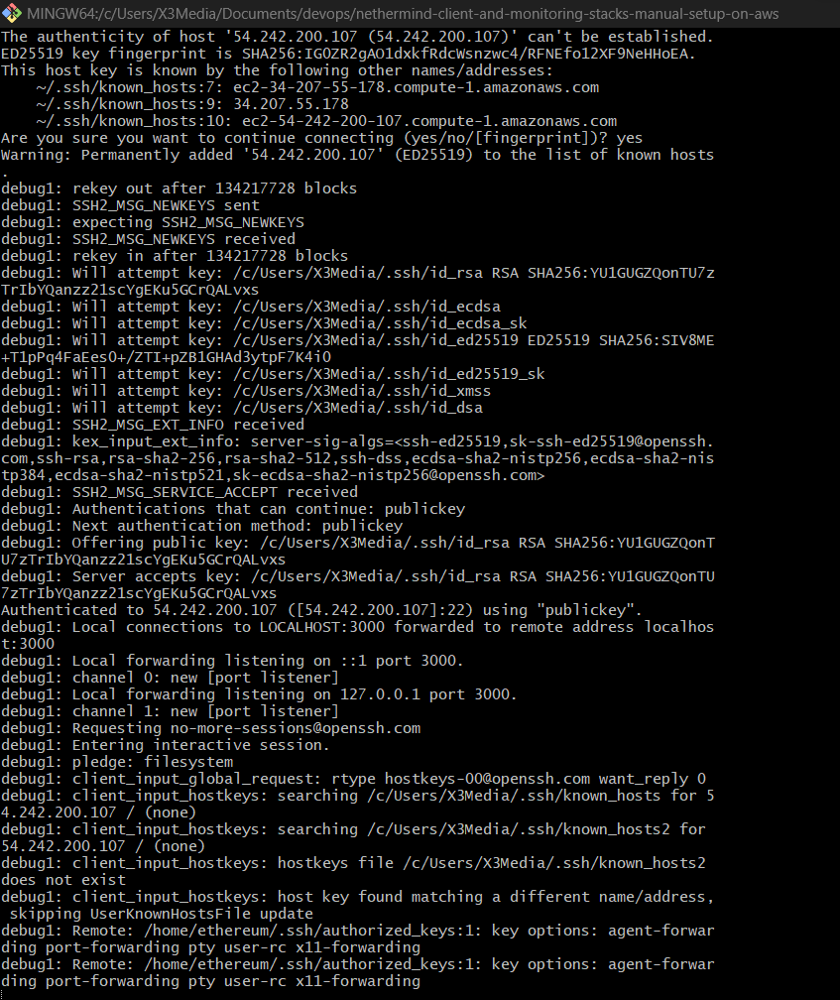
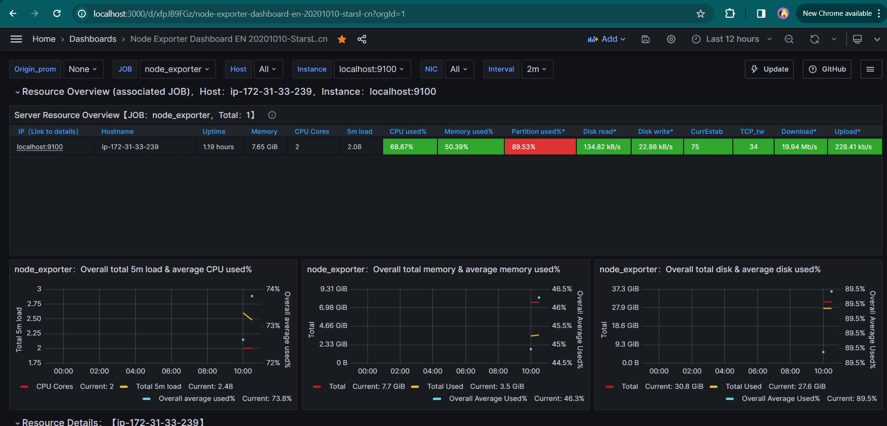

# Nethermind and Lodestar Clients with Monitoring Stacks Deployment on AWS
This repository documents my ambitious endeavor to deploy Nethermind and Lodestar blockchain clients using Goerli network along with their respective monitoring stacks.

# Step 1: Configure EC2 Instance (Node) on AWS
* After creating an ec2 instance on AWS using Linux Ubuntu OS, login to the Ubuntu server by connecting with local SSH client.<br/>
```
ssh username@ec2-public-ip-address
```


* Updated the node to ensure all the latest packages, tools and patches are installed first, then reboot.
```
sudo apt-get update -y && sudo apt dist-upgrade -y
sudo apt-get install git ufw curl ccze jq -y
sudo apt-get autoremove
sudo apt-get autoclean
sudo reboot
```
* Created a non-root user with sudo privileges
```
sudo useradd -m -s /bin/bash ethereum

sudo passwd ethereum

sudo usermod -aG sudo ethereum
```
* Created a jwtsecret file that will be passed to both Execution Layer client and Consensus Layer client to ensure authenticated communications between both clients.
```
sudo mkdir -p /secrets

openssl rand -hex 32 | tr -d "\n" | sudo tee /secrets/jwtsecret

sudo chmod 644 /secrets/jwtsecret
```

* Configure the firewall using the standard UFW to control network access to the node and protect against unwelcome intruders.
```
sudo ufw default deny incoming
sudo ufw default allow outgoing

sudo ufw allow 22/tcp comment 'Allow SSH port'

#Allow Execution Client Port 30303

sudo ufw allow 30303 comment 'Allow execution client port'

#Allow Consensus Client port

# Lighthouse, Lodestar, Nimbus, Teku
sudo ufw allow 9000 comment 'Allow consensus client port'

# Lighthouse Quic Port https://lighthouse-blog.sigmaprime.io/Quic.html
sudo ufw allow 9001/udp comment 'Allow lighthouse client quic port'

# Prysm
sudo ufw allow 13000/tcp comment 'Allow consensus client port'
sudo ufw allow 12000/udp comment 'Allow consensus client port'
```

* Enable firewall
```
sudo ufw enable
sudo ufw status numbered 
```


# Step 2: Installing Nethermind Execution Client
* Create a service user for the execution service, data directorty and assign ownership
```
sudo adduser --system --no-create-home --group execution
sudo mkdir -p /var/lib/nethermind
sudo chown -R execution:execution /var/lib/nethermind
```
* Install dependencies
```
sudo apt update
sudo apt install ccze curl libsnappy-dev libc6-dev jq libc6 unzip -y
```
* Download nethermind Binaries
```
RELEASE_URL="https://api.github.com/repos/NethermindEth/nethermind/releases/latest"
BINARIES_URL="$(curl -s $RELEASE_URL | jq -r ".assets[] | select(.name) | .browser_download_url" | grep linux-x64)"

echo Downloading URL: $BINARIES_URL

cd $HOME
wget -O nethermind.zip $BINARIES_URL
unzip -o nethermind.zip -d $HOME/nethermind
rm nethermind.zip

sudo mv $HOME/nethermind /usr/local/bin/nethermind
```
* Configure systemd by defining execution.service configuration unit.
```
sudo nano /etc/systemd/system/execution.service

[Unit]
Description=Nethermind Execution Layer Client service for Goerli
Wants=network-online.target
After=network-online.target
Documentation=https://www.coincashew.com

[Service]
Type=simple
User=execution
Group=execution
Restart=on-failure
RestartSec=3
KillSignal=SIGINT
TimeoutStopSec=900
WorkingDirectory=/var/lib/nethermind
Environment="DOTNET_BUNDLE_EXTRACT_BASE_DIR=/var/lib/nethermind"
ExecStart=/usr/local/bin/nethermind/nethermind \
  --config goerli \
  --datadir="/var/lib/nethermind" \
  --Network.DiscoveryPort 30303 \
  --Network.P2PPort 30303 \
  --Network.MaxActivePeers 50 \
  --JsonRpc.Port 8545 \
  --JsonRpc.EnginePort 8551 \
  --Metrics.Enabled true \
  --Metrics.ExposePort 6060 \
  --JsonRpc.JwtSecretFile /secrets/jwtsecret
  
[Install]
WantedBy=multi-user.target
```
* Run the following to enable auto-start at boot time
```
sudo systemctl daemon-reload
sudo systemctl enable execution

sudo systemctl start execution
sudo systemctl status execution
```

# Step 3: Installing Lodestar Consensus Client
* Create a service user for the consensus service, data directory and assign ownership.
```
sudo adduser --system --no-create-home --group consensus
sudo mkdir -p /var/lib/lodestar
sudo chown -R consensus:consensus /var/lib/lodestar
```
* Install dependencies
```
sudo apt-get install gcc g++ make git curl -y
```
* Install lodestar from Binaries
```
curl -sS https://dl.yarnpkg.com/debian/pubkey.gpg | sudo apt-key add -
echo "deb https://dl.yarnpkg.com/debian/ stable main" | sudo tee /etc/apt/sources.list.d/yarn.list
sudo apt update
sudo apt install yarn -y

yarn --version

curl -fsSL https://deb.nodesource.com/setup_20.x | sudo -E bash - &&\
sudo apt-get install -y nodejs

mkdir -p ~/git
cd ~/git
git clone -b stable https://github.com/chainsafe/lodestar.git
cd lodestar
yarn install
yarn run build

./lodestar --version

sudo cp -a $HOME/git/lodestar /usr/local/bin/lodestar
```
* Setup and configure systemd unit file to define consensus.service configuration.
```
sudo nano /etc/systemd/system/consensus.service

[Unit]
Description=Lodestar Consensus Layer Client service for Goerli
Wants=network-online.target
After=network-online.target
Documentation=https://www.coincashew.com

[Service]
Type=simple
User=consensus
Group=consensus
Restart=on-failure
RestartSec=3
KillSignal=SIGINT
TimeoutStopSec=900
WorkingDirectory=/usr/local/bin/lodestar
ExecStart=/usr/local/bin/lodestar/lodestar beacon \
  --dataDir /var/lib/lodestar \
  --network goerli \
  --metrics true \
  --checkpointSyncUrl https://goerli.beaconstate.info \
  --jwt-secret /secrets/jwtsecret \
  --execution.urls http://127.0.0.1:8551 \

[Install]
WantedBy=multi-user.target

sudo systemctl daemon-reload
sudo systemctl enable consensus

sudo systemctl start consensus
sudo systemctl status consensus
```


# Step 4: Monitoring with Grafana and Prometheus
* Install Prometheus and Node Exporter
```
sudo apt-get install -y prometheus prometheus-node-exporter
```
* Install Grafana
```
sudo apt-get install -y apt-transport-https
sudo apt-get install -y software-properties-common wget
sudo wget -q -O /usr/share/keyrings/grafana.key https://apt.grafana.com/gpg.key

echo "deb [signed-by=/usr/share/keyrings/grafana.key] https://apt.grafana.com stable main" | sudo tee -a /etc/apt/sources.list.d/grafana.list
sudo apt-get update && sudo apt-get install -y grafana
```
* Enable services to start automatically.
```
sudo systemctl enable grafana-server prometheus prometheus-node-exporter
```
* Create prometheus.yml config file
```
sudo rm /etc/prometheus/prometheus.yml
sudo nano /etc/prometheus/prometheus.yml

#Paste the following configuration to the file
global:
  scrape_interval:     15s # By default, scrape targets every 15 seconds.

  # Attach these labels to any time series or alerts when communicating with
  # external systems (federation, remote storage, Alertmanager).
  external_labels:
    monitor: 'codelab-monitor'

# A scrape configuration containing exactly one endpoint to scrape:
# Here it's Prometheus itself.
scrape_configs:
   - job_name: 'node_exporter'
     static_configs:
       - targets: ['localhost:9100']
   - job_name: 'beacon'
     metrics_path: /metrics    
     static_configs:
       - targets: ['localhost:8008']
   - job_name: 'validator'
     metrics_path: /metrics    
     static_configs:
       - targets: ['localhost:5064']
```
* Setup prometheus for execution client by appending the following to prometheus.yml
```
   - job_name: 'nethermind'
     static_configs:
       - targets: ['localhost:6060']
```
* Update the prometheus.yml file permission
```
sudo chmod 644 /etc/prometheus/prometheus.yml

sudo systemctl restart grafana-server prometheus prometheus-node-exporter

sudo systemctl status grafana-server prometheus prometheus-node-exporter
```
* Create SSH Tunnel to Grafana to access it with port 3000 forwarded
```
ssh -N -v ethereum@192.168.1.69 -L 3000:localhost:3000
```

* Setup Grafana Dashboards by opening http://localhost:3000


Node-exporter Dashboard

Nethermind Client Dashboard

Lodestart Dashboard